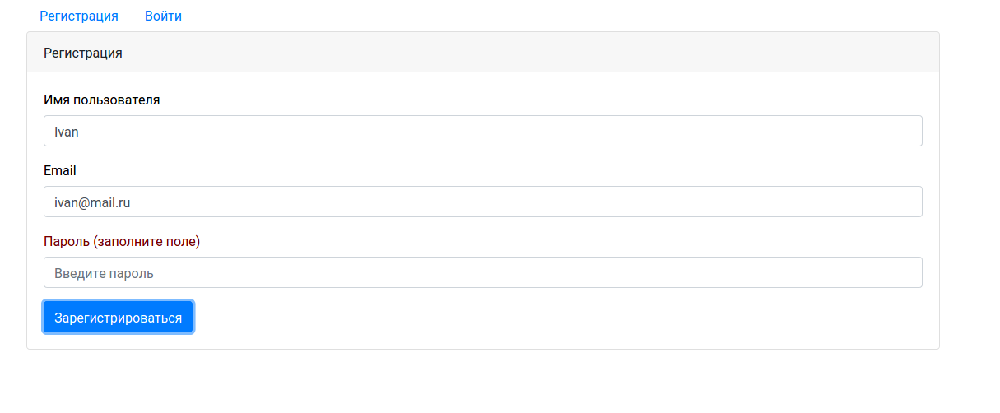
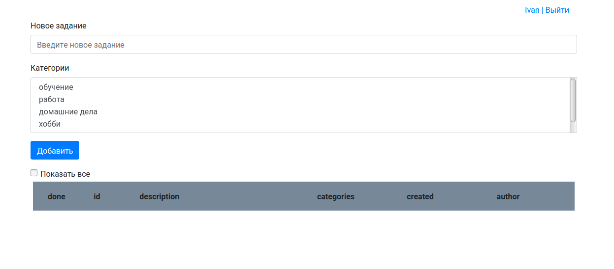
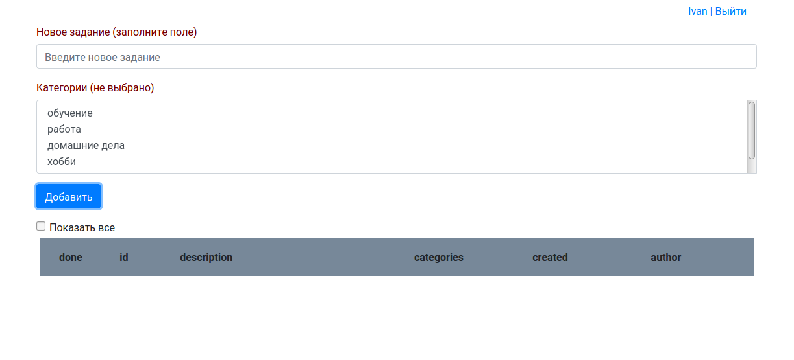
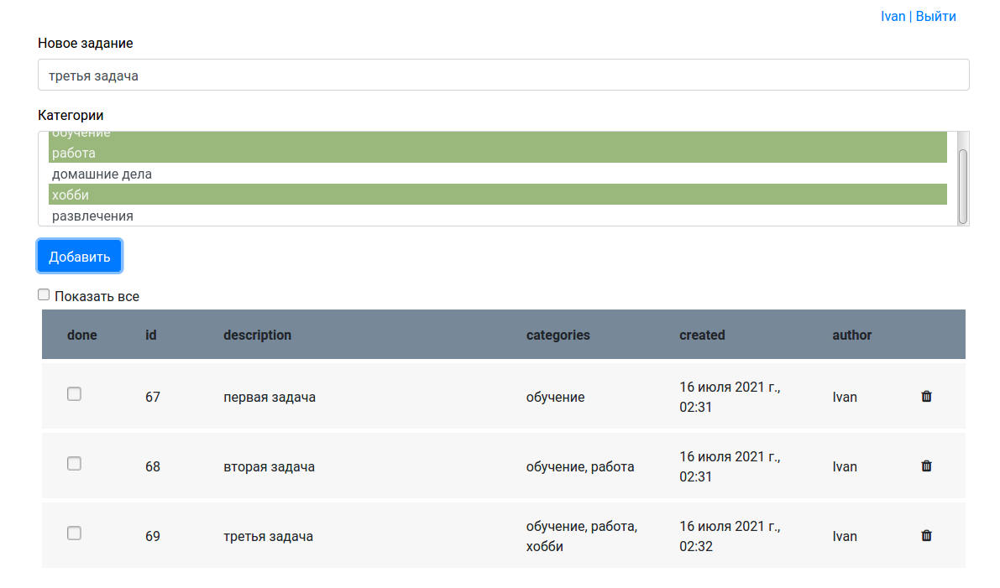
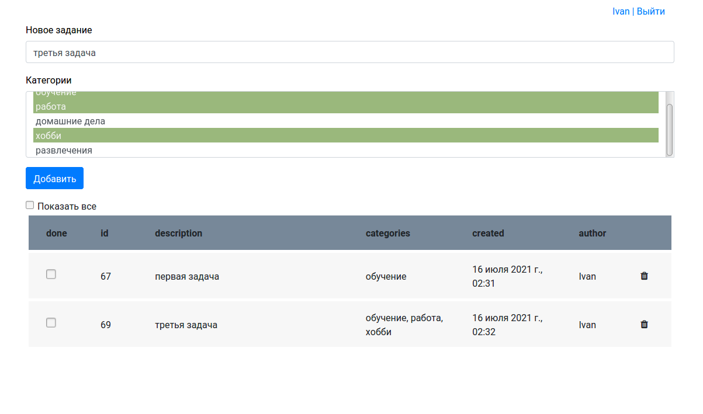

#TODO список

Используются следующие технологии:
 - Java
 - Maven
 - Servlets
 - PostgreSQL
 - Hibernate
 - Travis CI
 - slf4j/log4j
 - HTML
 - CSS
 - JavaScript
 - JQuery
 - AJAX

Интерфейс проекта

